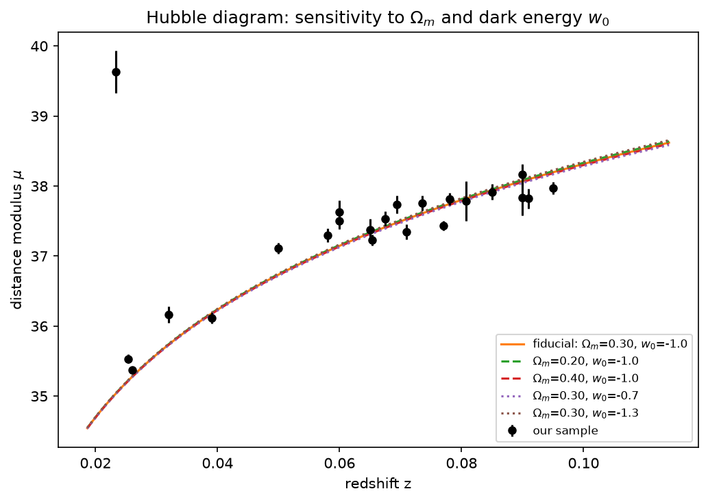

# DESC demo: dark matter + dark energy, two ways

A sample project demonstrating LSST DESC-style analysis across DESC's two
main probes, using entirely **public data** (DES DR1 + live ZTF alerts via
Fink — no DC2 / RSP access required) and DESC's own software stack (CLMM,
CCL, sncosmo) plus community-standard tools (TreeCorr, astropy).

1. **Weak lensing** — one DES DR1 shape catalog, two observables: cluster
   mass (dark matter) and cosmic shear (dark energy).
2. **SN Ia** — a full discovery-to-Hubble-diagram pipeline against Fink's
   live ZTF alert stream: TNS-confirmed candidates → light curves → quality
   filtering → SALT2 fits → standardized distances → Hubble diagram vs. CCL
   theory, plus an interactive Streamlit viewer for every stage.

## Weak lensing: Results

### Dark matter: cluster mass from weak lensing


NFW halo mass fit with [CLMM](https://github.com/LSSTDESC/CLMM) (LSST
DESC's cluster-lensing package) via the azimuthally-averaged tangential
shear profile — the robust, standard measurement. A 2D Kaiser & Squires
(1993) convergence map is shown alongside for illustration; it's shape-noise
limited for a single cluster at this depth/field size and isn't a
standalone detection on its own (captioned honestly in the figure).

**Result: M200c = 3.21×10¹⁴ ± 1.13×10¹⁴ M☉** (~2.8σ, 5885 background
galaxies) for `RMJ051637.4-543001.6` (ACO S520, z≈0.304) — the same cluster
used in LSST DESC's own CLMM worked example, giving a direct literature
cross-check. The metacalibration response calibration (`r_diag = 0.7088`)
matches that tutorial's published value exactly.

### Dark energy: cosmic shear two-point function


Cosmic shear correlation function ξ+(θ) measured with
[TreeCorr](https://github.com/rmjarvis/TreeCorr) and compared to ΛCDM
theory curves generated with [CCL](https://github.com/LSSTDESC/CCL) (LSST
DESC's Core Cosmology Library), computed directly from the sample's own
measured dn/dz. The right panel shows how the predicted curve shifts with
Ωm and the dark energy equation-of-state w0 — the sensitivity DESC's 3x2pt
analysis exploits to constrain dark energy.

This field (~7 sq deg) is far smaller than a real cosmic shear survey area
(DES Y1: ~1500 sq deg), so the measurement is shape-noise/cosmic-variance
limited — it demonstrates the full pipeline (TAP retrieval → TreeCorr →
CCL comparison) rather than a standalone cosmological constraint.

## SN Ia: Results



End-to-end pipeline against Fink's live ZTF alert stream (both the ZTF and
LSST instances — Rubin's own alert stream, live since June 2026, once an
object accumulates enough epochs):

1. **Discovery** — Fink's TNS cross-match, filtered to spectroscopically
   confirmed `SN Ia` with a usable ZTF ID and redshift (ground-truth labels,
   not a probabilistic ML guess), pre-checked for actually having archived
   photometry (~20-80% of TNS-confirmed candidates don't, depending on age).
2. **Photometry** — every archived alert per object, reshaped directly into
   `sncosmo`'s expected schema.
3. **Quality filtering** — band/point-count minimums, span bounds (20-365
   days), and a peak-bracketing check, thresholds picked against real
   objects pulled during development, not chosen abstractly.
4. **SALT2 fit** via `sncosmo`/`iminuit`, redshift fixed at the spectroscopic
   value, restricted to SALT2's calibrated rest-frame phase window (-20 to
   +50 days — points outside it produce spurious multi-sigma residuals from
   evaluating the model outside its valid range, not real light-curve
   information; verified directly on a real object where this dropped
   χ²/dof from 7.88 to 0.31 without moving the fit parameters).
5. **Standardization** — Tripp/Phillips formula with fixed literature
   α/β/M_B (not derived from this data — a real, documented limitation).
6. **Hubble diagram** vs. CCL theory curves for varying Ωm/w0.

**Result**: 23/40 candidates (first batch, newest-first) made it through
all 5 stages cleanly. The one clear outlier in the diagram is independently
flagged by its own fit diagnostic (χ²/dof = 4.21, worst in the sample) —
the Stage 4 quality metric catching a real problem, not a coincidence.

**Honest limitation, and the actual point of the plot**: the theory curves
for Ωm ∈ [0.20, 0.40] and w0 ∈ [-1.3, -0.7] are visually indistinguishable
across this sample's redshift range (z ≈ 0.02-0.11) — confirmed directly
(the curves differ by only ~0.01-0.03 mag there, versus ~0.06-0.3 mag
per-object measurement uncertainty). That's real physics, not a bug: dark
energy's effect on distance only becomes distinguishable from a single
SN's measurement past z ≈ 0.3-0.5. This pipeline reproduces the correct
*method* end-to-end on real data; it isn't a new cosmological constraint,
and the plot itself is the honest demonstration of why it isn't.

An interactive Streamlit viewer (`ui/app.py`) shows every stage live —
cutout images, light curves, fit diagnostics — for any candidate, not just
the batch summary above.

## Data

Weak lensing: shapes + photo-z come from the public
`des_dr1.shape_metacal_riz_unblind` and `des_dr1.photo_z` tables on the
[NOIRLab Data Lab](https://datalab.noirlab.edu) TAP service — queried
directly via `pyvo`, no notebooks or bulk downloads.

SN Ia: alerts, photometry, and cutouts come from the
[Fink broker](https://fink-broker.org)'s public REST API (ZTF + LSST
instances) — no data rights or institutional affiliation required, since
Fink serves already-public alert-stream data.

Downloaded/cached data lives outside the repo, on an external volume (see
`src/desc_demo/config.py`, override with `ASTRO_DATA_DIR`); the final
figures are copied into `figures/` and committed so they render directly
on GitHub.

## Layout

```
src/desc_demo/
  config.py              # paths, TAP/Fink endpoints, default cluster target
  data_access.py         # TAP query + metacal response calibration
  mass_map.py            # Kaiser-Squires + CLMM NFW fit
  shear_tomography.py    # TreeCorr xi+/xi- + CCL theory curves
  sn_discovery.py        # Stage 1: TNS-confirmed candidates + availability filter
  sn_cutouts.py           # science/template/difference cutout images
  sn_photometry.py         # Stage 2: light curve retrieval + plotting
  sn_quality.py             # Stage 3: fittability checks
  sn_fitting.py              # Stage 4: SALT2 fit via sncosmo
  sn_standardization.py       # Stage 5: Tripp/Phillips distance modulus
  sn_hubble.py                  # Stage 6: batch pipeline + Hubble diagram + CCL theory
scripts/
  fetch_catalog.py           # CLI: pull + cache the shape/photo-z catalog
  run_mass_map.py             # CLI: print CLMM fit + KS map summary
  run_shear_tomography.py      # CLI: print tomographic xi+/xi- summary
  run_sn_discovery.py           # CLI: print Stage 1 candidates
  plot_mass_map.py                # generates figures/dark_matter_mass_map.png
  plot_shear_tomography.py         # generates figures/dark_energy_cosmic_shear.png
  plot_sn_hubble.py                 # generates figures/sn_hubble_diagram.png
ui/
  app.py                  # interactive Streamlit viewer for the SN Ia pipeline
```

## Reproducing

```
python3 -m venv .venv && source .venv/bin/activate
pip install -r requirements.txt -e .

# weak lensing
CLMM_MODELING_BACKEND=ccl python scripts/plot_mass_map.py
CLMM_MODELING_BACKEND=ccl python scripts/plot_shear_tomography.py

# SN Ia (network-bound: light curve fetch + SALT2 fit per candidate)
python scripts/plot_sn_hubble.py

# interactive SN Ia viewer
streamlit run ui/app.py
```

(`CLMM_MODELING_BACKEND` is set automatically by `desc_demo.config` when
importing the package, so plain `python scripts/...` also works.)
