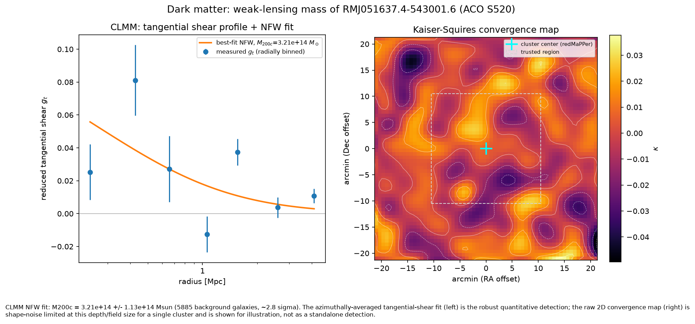
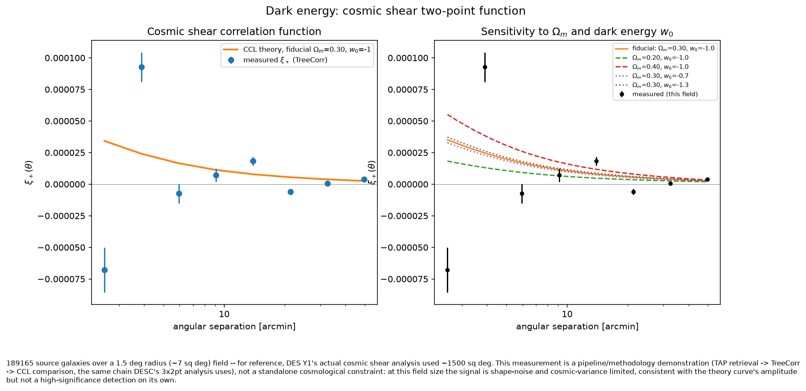

# DESC demo: dark matter + dark energy from weak lensing

A sample project demonstrating LSST DESC-style weak-lensing analysis, using
**public DES DR1 data** (no DC2 / RSP access required). One shape catalog,
two DESC observables, built entirely on DESC's own software stack (CLMM,
CCL) plus the community-standard TreeCorr.

## Results

### Dark matter: cluster mass from weak lensing



NFW halo mass fit with [CLMM](https://github.com/LSSTDESC/CLMM) (LSST
DESC's cluster-lensing package) via the azimuthally-averaged tangential
shear profile — the robust, standard measurement. A 2D Kaiser & Squires
(1993) convergence map is shown alongside for illustration; it's shape-noise
limited for a single cluster at this depth/field size and isn't a
standalone detection on its own (captioned honestly in the figure).

**Result: M200c = 3.21×10¹⁴ ± 1.13×10¹⁴ M☉** (~2.8σ, 5885 background
galaxies) for `RMJ051637.4-543001.6` (ACO S520, z≈0.304) — the same cluster
used in LSST DESC's own CLMM worked example, giving a direct literature
cross-check. The metacalibration response calibration (`r_diag = 0.7088`)
matches that tutorial's published value exactly.

### Dark energy: cosmic shear two-point function



Cosmic shear correlation function ξ+(θ) measured with
[TreeCorr](https://github.com/rmjarvis/TreeCorr) and compared to ΛCDM
theory curves generated with [CCL](https://github.com/LSSTDESC/CCL) (LSST
DESC's Core Cosmology Library), computed directly from the sample's own
measured dn/dz. The right panel shows how the predicted curve shifts with
Ωm and the dark energy equation-of-state w0 — the sensitivity DESC's 3x2pt
analysis exploits to constrain dark energy.

This field (~7 sq deg) is far smaller than a real cosmic shear survey area
(DES Y1: ~1500 sq deg), so the measurement is shape-noise/cosmic-variance
limited — it demonstrates the full pipeline (TAP retrieval → TreeCorr →
CCL comparison) rather than a standalone cosmological constraint.

## Data

Shapes + photo-z come from the public `des_dr1.shape_metacal_riz_unblind`
and `des_dr1.photo_z` tables on the
[NOIRLab Data Lab](https://datalab.noirlab.edu) TAP service — queried
directly via `pyvo`, no notebooks or bulk downloads.

Downloaded/cached data lives outside the repo, on an external volume (see
`src/desc_demo/config.py`, override with `ASTRO_DATA_DIR`); the final
figures are copied into `figures/` and committed so they render directly
on GitHub.

## Layout

```
src/desc_demo/
  config.py              # paths, TAP endpoint, default cluster target
  data_access.py         # TAP query + metacal response calibration
  mass_map.py            # Kaiser-Squires + CLMM NFW fit
  shear_tomography.py    # TreeCorr xi+/xi- + CCL theory curves
scripts/
  fetch_catalog.py           # CLI: pull + cache the shape/photo-z catalog
  run_mass_map.py             # CLI: print CLMM fit + KS map summary
  run_shear_tomography.py      # CLI: print tomographic xi+/xi- summary
  plot_mass_map.py              # generates figures/dark_matter_mass_map.png
  plot_shear_tomography.py       # generates figures/dark_energy_cosmic_shear.png
```

## Reproducing

```
python3 -m venv .venv && source .venv/bin/activate
pip install -r requirements.txt -e .
CLMM_MODELING_BACKEND=ccl python scripts/plot_mass_map.py
CLMM_MODELING_BACKEND=ccl python scripts/plot_shear_tomography.py
```

(`CLMM_MODELING_BACKEND` is set automatically by `desc_demo.config` when
importing the package, so plain `python scripts/...` also works.)
